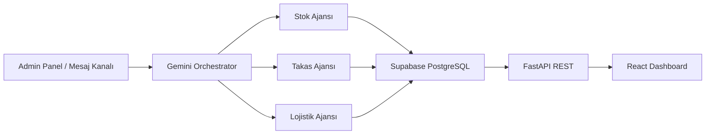

# CoopLink - Green Orchestrator

CoopLink - Green Orchestrator, tarım ve gıda kooperatiflerini tek tek yönetmek yerine onları ortak bir ağ zekası gibi çalıştıran yapay zeka tabanlı bir ekosistemdir. FastAPI, Supabase, Gemini ve React paneli üzerinden stok görünürlüğü, takas önerisi, rota optimizasyonu ve yeşil puan takibi sağlar.

## Problem

- Türkiye'de her yıl yaklaşık 23 milyon ton gıda israf ediliyor; üretilen gıdanın yaklaşık yüzde 35'i sofraya ulaşmadan kayboluyor veya çöpe gidiyor. Kaynak: [Anadolu Ajansı, 16 Ekim 2024](https://www.aa.com.tr/tr/gundem/turkiyede-her-yil-ortalama-23-milyon-ton-gida-israf-ediliyor/3363619)
- UNEP Food Waste Index Report 2024'e göre dünyada 2022 yılında 1.05 milyar ton gıda atığı oluştu; bu kişi başına yıllık 132 kg anlamına geliyor. Kaynak: [UNEP Food Waste Index Report 2024](https://www.unep.org/resources/publication/food-waste-index-report-2024)
- Gıda kaybı ve atığı, tüketilmeyen gıdaya bağlı sera gazı emisyonlarının önemli bir kısmını oluşturuyor; UNEP 2021 raporu gıda israfının küresel sera gazı emisyonlarının yaklaşık yüzde 8-10'u ile ilişkili olduğunu belirtiyor. Kaynak: [UNEP Food Waste Index Report 2021](https://www.unep.org/resources/report/unep-food-waste-index-report-2021)

## Çözüm

CoopLink - Green Orchestrator, kooperatiflerin stok, talep ve teslimat bilgisini tek ağda birleştirir:

1. Stok sorgusu: "10 kg elma var mı?" mesajı ağ genelinde aranır.
2. İsraf önleme: "Elimde 80 kg domates var, bozulacak" mesajı risk skoru ve takas önerisi üretir.
3. Lojistik optimizasyonu: Yakın kooperatifler için ortak teslimat rotası ve CO2 tasarrufu hesaplanır.

## AI Senaryoları

- İsraf erken uyarı: Son kullanma tarihi, miktar ve risk skoruna göre acil stokları öne çıkarır.
- Doğal dil mesaj asistanı: Stok sorgusu, takas önerisi, teslimat durumu ve rapor isteklerini ayırır.
- Akıllı takas eşleştirme: Talep uyumu, mesafe, aciliyet ve karbon etkisini skorlayarak öneri üretir.
- Rota ve araç planlama: Komşu teslimatları birleştirip CO2 tasarrufunu hesaplar.
- Haftalık yönetici özeti: Kurtarılan gıda, karbon, puan ve aksiyon önerilerini Türkçe raporlar.
- Talep tahmini: Bölge, sezon ve geçmiş takaslardan ürün ihtiyacını öngörür.

## Rakip Analizi

| Çözüm | Güçlü Yan | Eksik Yan | CoopLink Farkı |
| --- | --- | --- | --- |
| Klasik ERP | Stok takibi güçlü | Küçük kooperatif için pahalı ve ağır | Sade admin paneli, düşük bariyerli kullanım |
| Marketplace | Talep yaratır | İsraf riski ve rota zekası yok | Ağ içi takas ve karbon puanı |
| Lojistik yazılımları | Rota optimizasyonu | Ürün bozulma riskini bilmez | Stok riski + rota + takas birlikte |
| Manuel mesaj grupları | Kullanımı kolay | Veri kalıcı ve raporlanabilir değil | Mesaj ve stok bilgisini yapısal veriye çevirir |

## Mimari Şema



## Tech Stack

Backend:
- FastAPI, Uvicorn
- Supabase PostgreSQL
- Gemini 1.5 Flash için orchestrator katmanı
- Pytest ve pytest-asyncio

Frontend:
- React 18 + Vite
- TailwindCSS
- React Query
- Recharts
- Axios

## Kurulum

Bu bölüm projeyi kendi bilgisayarında açmak isteyen kişiler içindir. Proje iki parçadan oluşur:

- Backend: FastAPI API servisi
- Frontend: React admin paneli

İkisini aynı anda çalıştırmak için genelde iki ayrı terminal açılır.

### Gerekenler

Bilgisayarda şunlar kurulu olmalı:

- Python 3.11 veya üzeri
- Node.js 18 veya üzeri
- npm
- Supabase hesabı isteğe bağlıdır; `.env` doldurulmazsa proje demo fallback verisiyle de çalışabilir.

Kontrol etmek için:

```bash
python --version
node --version
npm --version
```

Windows'ta `python` çalışmazsa şunu dene:

```bash
py --version
```

### 1. Proje klasörüne gir

Eğer repo klonlanacaksa:

```bash
git clone <repo-url>
cd YZTA-Hackathon
```

Zaten klasör bilgisayardaysa doğrudan proje dizinine gir:

```powershell
cd C:\Users\mertu\OneDrive\Masaüstü\YZTA-Hackathon
```

### 2. Ortam değişkenlerini hazırla

```bash
cp .env.example .env
```

Windows PowerShell için:

```powershell
copy .env.example .env
```

Demo modda çalıştıracaksan `.env` içindeki Supabase ve Gemini alanlarını boş/placeholder bırakabilirsin. Gerçek Supabase ve Gemini kullanacaksan ilgili anahtarları doldur.

### 3. Supabase kullanacaksan SQL dosyalarını çalıştır

Supabase SQL Editor içinde önce şemayı çalıştır:

```bash
backend/app/db/schema.sql
```

Sonra demo veriyi eklemek için:

```bash
backend/app/db/mock_data.sql
```

Daha önce eski şemayı çalıştırdıysan ve kolon isimleri farklıysa şu migration dosyasını da bir kez çalıştır:

```bash
backend/app/db/remove_twilio_migration.sql
```

Supabase kullanmıyorsan bu adımı atlayabilirsin.

### 4. Backend'i çalıştır

Birinci terminalde:

```bash
cd backend
python -m venv .venv
.venv\Scripts\activate
pip install -r requirements.txt
uvicorn app.main:app --reload
```

Windows'ta `python` çalışmıyorsa:

```powershell
py -m venv .venv
.\.venv\Scripts\activate
pip install -r requirements.txt
uvicorn app.main:app --reload
```

Backend açılınca şu adresler çalışır:

- API: http://localhost:8000
- Swagger dokümantasyonu: http://localhost:8000/docs
- Sağlık kontrolü: http://localhost:8000/health

### 5. Frontend'i çalıştır

İkinci terminalde:

```bash
cd frontend
npm install
npm run dev
```

Frontend açılınca:

- Admin panel: http://localhost:5173
- Operasyon merkezi: http://localhost:5173/operations
- Stok ekranı: http://localhost:5173/inventory
- Takas ekranı: http://localhost:5173/swaps
- AI logları: http://localhost:5173/ai-logs
- Leaderboard: http://localhost:5173/leaderboard

### 6. Hızlı test

Backend çalışırken Orchestrator'a test mesajı göndermek için:

```powershell
Invoke-WebRequest -Method POST `
  -Uri http://localhost:8000/assistant/message `
  -ContentType "application/json" `
  -Body '{"channel_id":"local-test","message":"10 kg elma var mı?"}'
```

Yanıt geldikten sonra AI logları ekranını aç:

```text
http://localhost:5173/ai-logs
```

### Sık karşılaşılan sorunlar

- `python is not recognized`: Python kurulu değildir veya PATH'e eklenmemiştir. Windows'ta `py` komutunu dene.
- `npm is not recognized`: Node.js kurulmamıştır.
- Frontend veri çekemiyor: Backend'in `http://localhost:8000` üzerinde çalıştığını kontrol et.
- Supabase hatası alıyorsan: `.env` değerlerini kontrol et veya demo fallback modu için Supabase alanlarını placeholder bırak.

## API Dokümantasyonu

| Endpoint | Metot | Açıklama |
| --- | --- | --- |
| `/health` | GET | Servis ve Supabase bağlantı durumu |
| `/assistant/message` | POST | Orchestrator'a kanal bağımsız mesaj gönderir |
| `/cooperatives` | GET | Kooperatif listesini döner |
| `/products` | GET | Ürün listesini döner |
| `/ai-logs` | GET | Gemini/Orchestrator karar loglarını döner |
| `/inventory` | GET | Kooperatif bazlı veya ağ geneli stok listesi |
| `/inventory` | POST | Yeni envanter kaydı ve risk skoru hesabı |
| `/swaps` | GET | Duruma göre takas listesi |
| `/swaps/{id}` | PATCH | Takas onay/red güncellemesi |
| `/stats` | GET | Gıda, karbon, takas ve kooperatif özetleri |
| `/stats/leaderboard` | GET | Yeşil puana göre kooperatif sıralaması |
| `/docs` | GET | Otomatik OpenAPI dokümantasyonu |

## Frontend Rotaları

| Rota | Ekran |
| --- | --- |
| `/` veya `/dashboard` | Ana yönetim paneli |
| `/operations` | Admin operasyon merkezi |
| `/ai-logs` | Gemini ve Orchestrator karar logları |
| `/inventory` | Stok ve risk takibi |
| `/swaps` | Takas onay/red yönetimi |
| `/leaderboard` | Yeşil puan sıralaması |

## Gemini Buton Kullanımı

Stok ekranındaki `Gemini Analiz` butonu, seçili stok satırını doğal dil mesajına çevirip `/assistant/message` endpoint'ine gönderir. Backend bu mesajı Orchestrator'a iletir. `.env` içinde geçerli `GEMINI_API_KEY` varsa Gemini intent seçiminde devreye girer; sonuç toast mesajı olarak görünür ve `/ai-logs` ekranına kaydedilir.

Örnek üretilen mesaj:

```text
Ege Tarım Kooperatifi kooperatifinde 80 kg domates var. Risk skoru 1.00. Bu ürün için stok sorgusu mu, takas önerisi mi yoksa teslimat takibi mi yapılmalı? Gerekirse takas öner.
```

## Demo Senaryoları

### 1. Müşteri Sorusu
1. Kullanıcı admin panelinden veya mesaj kanalından yazar: "Organik süt var mı?"
2. Orchestrator intent'i `query_stock` olarak belirler.
3. Stok Ajansı ağdaki uygun stoğu arar.
4. Yanıt: "Ağda 1 uygun stok kaydı bulundu."

### 2. Üretici İsraf Bildirimi
1. Kullanıcı yazar: "Elimde 80 kg domates var, bozulacak"
2. Orchestrator intent'i `propose_swap` olarak belirler.
3. Swap Ajansı weighted scorer ile en iyi eşleşmeyi üretir.
4. Yanıt: "Takas önerisi... Skor: 0.87. Onayla / Reddet / Değiştir"

### 3. Yönetici Raporu
1. Dashboard veya `/stats` açılır.
2. Toplam kurtarılan gıda, CO2 tasarrufu, bekleyen takas ve aktif kooperatif sayısı görülür.
3. Leaderboard ekranında yeşil puan sıralaması izlenir.

## Katkı

Geliştirme adımları için [ROADMAP.md](./ROADMAP.md) dosyasını takip edin. Faz 1-5 demo için zorunlu çekirdeği, Faz 6 ise ses entegrasyonunu kapsar.
